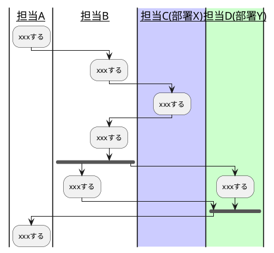
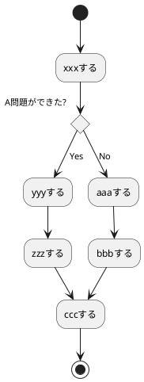
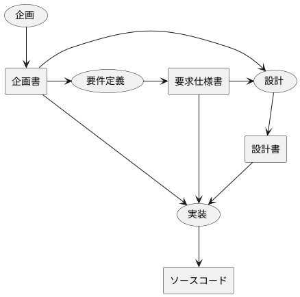
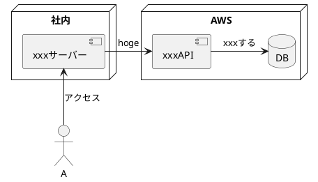
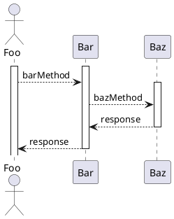
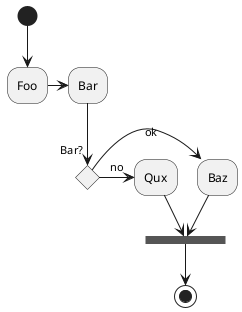
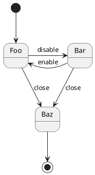

コードスニペット（markdown.json）には以下のスニペットが保存されている

参考記事：
[会議を爆速にする、Visual Studio Code 超便利スニペット集](https://qiita.com/kitfactory/items/31cdf80cf1d3d8b42de8)

---

呼び出しコード：**meeting**

## xxxx会議録
日時:2018/10/xx
場所:xxx会議室
出席者:xxx,xxx,xxx,xxx

### 1.目的
* xxxxの対応を決める。
* xxxxの対応を決める。

### 2.結論
* xxxxをxxxとする。
* xxxxをxxxとする。

### 3.A.I.
* xxxxxする。(担当: xxx 期日： x/xまで)
* xxxxxする。(担当: xxx 期日： x/xまで)
* xxxxxする。(担当: xxx 期日： x/xまで)

### 4.議論
* xxxxはxxxではないか？(Aさん)
→ xxxにする。

---

呼び出しコード：**pros_cons**

|案|メリット|デメリット|決定|
|:--|:--|:--|:--|
|案A:xxxする| | | |
|案B:xxxする| | | |
|案C:xxxする| | | |

---

呼び出しコード：**workflow**

---

呼び出しコード：**pdpc**

__PDPC__

---

呼び出しコード：**pfd**

__開発プロセス(PFD)__

---

呼び出しコード：**system_component**

---

呼び出しコード：**uml_sequence**

[help](http://yohshiy.blog.fc2.com/blog-entry-153.html)

---

呼び出しコード：**uml_activity**

---

呼び出しコード：**uml_state**

---

